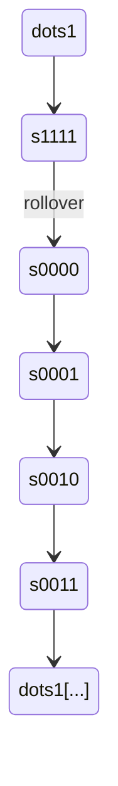

# Sequential Digital Design Projects in Verilog

A collection of fundamental sequential digital circuits — storage elements, registers, counters, and shift registers — designed and verified in Verilog HDL. Each module builds toward the same control and datapath concepts used in larger designs like FSMs and CPUs.

---

## Why This Repository

Sequential logic is the foundation everything else is built on — flip-flops become registers, registers become counters and ALUs, and all of it is sequenced by FSMs like the ones in my [Traffic Light FSM](https://github.com/vivekrai97709/TrafficLightFSM) and [8-bit CPU](https://github.com/vivekrai97709/CONTROL_UNIT_OF_UC) projects. This repo documents that progression bottom-up.

---

## Projects Included

### 1. D Flip-Flop (DFF)

Positive-edge triggered, the basic 1-bit storage element underlying every sequential circuit here.

| Clock Edge | D | Q(next) |
|---|---|---|
| ↑ | 0 | 0 |
| ↑ | 1 | 1 |

**Concepts:** Sequential logic, edge triggering, non-blocking assignments


---

### 2. 4-Bit Register

A synchronous 4-bit register built from D flip-flops, storing multi-bit data on each clock edge.
Input  = 1010

Clock ↑

Output = 1010
**Concepts:** Register design, module instantiation, multi-bit sequential logic


---

### 3. 4-Bit Up Counter

A synchronous modulo-16 counter, incrementing every clock cycle with automatic rollover.



**Concepts:** Sequential counting, state retention, counter design


---

### 4. 4-Bit Serial-In Shift Register

Accepts serial data and shifts it through the register on each clock cycle.

**Example:**
Input stream: `1 → 0 → 1 → 1`

| Cycle | Register Contents |
|---|---|
| 0 | `0000` |
| 1 | `0001` |
| 2 | `0010` |
| 3 | `0101` |
| 4 | `1011` |

**Concepts:** Bit slicing, concatenation operator, shift operations, register transfer logic


> Place each screenshot in its corresponding sub-folder's `waveform/` directory and confirm filenames match the paths above.

---

## Repository Structure
├── D_flipflop/

├── 4bitregister/

├── upcounter4bit/

├── Serial_in_shiftregister/

├── ALU4bit/

└── README.md
---

## Tools Used

Verilog HDL · Icarus Verilog · GTKWave · VS Code · Git & GitHub

---

## Simulation Flow

```bash
iverilog -o sim rtl/design.v tb/design_tb.v
vvp sim
gtkwave wave.vcd
```

---

## Key Concepts Covered

**Sequential Logic:** D flip-flops, registers, counters, shift registers
**RTL Design:** Module instantiation, clocked logic, reset logic, bit manipulation
**Verification:** Testbench development, waveform analysis, simulation-based debugging

---

## Future Work

- UART Transmitter / Receiver
- Universal shift register (parameterized direction + width)
- Vending machine FSM
- Single-cycle CPU (builds on [CONTROL_UNIT_OF_UC](https://github.com/vivekrai97709/CONTROL_UNIT_OF_UC))

---

## Author

**Vivek Rai** — Electronics & Telecommunication Engineering, TSEC Mumbai
Interests: Digital Design · FPGA · Computer Architecture · VLSI · Embedded Systems
